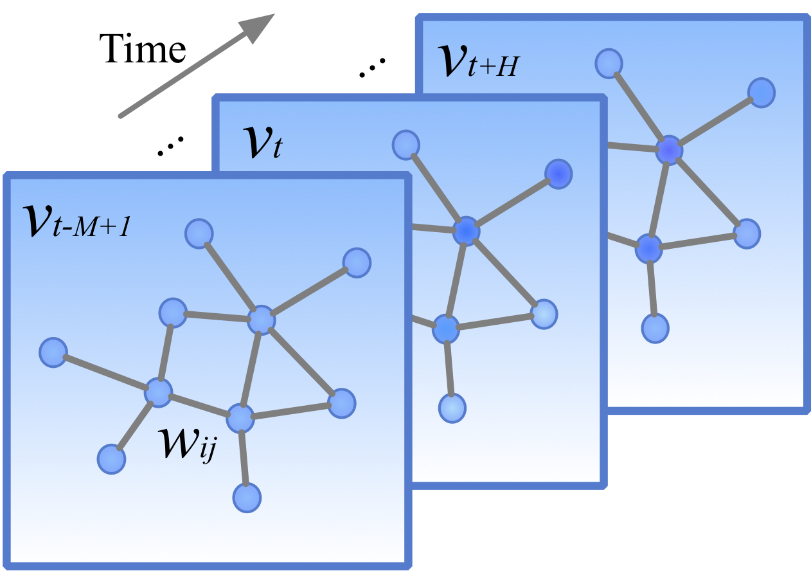
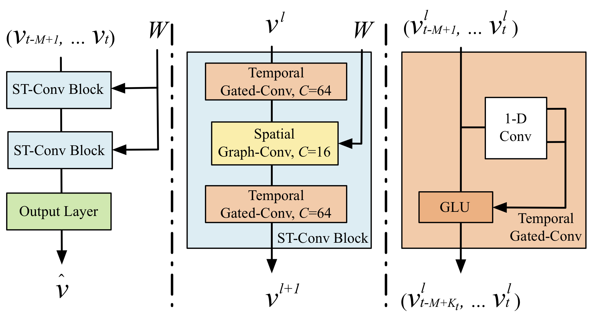
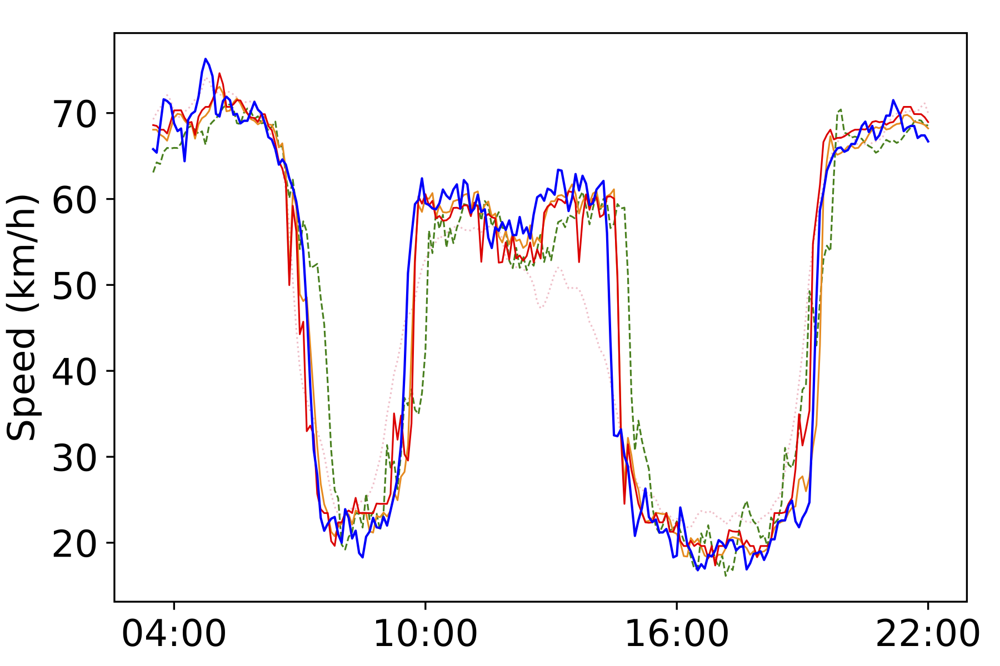
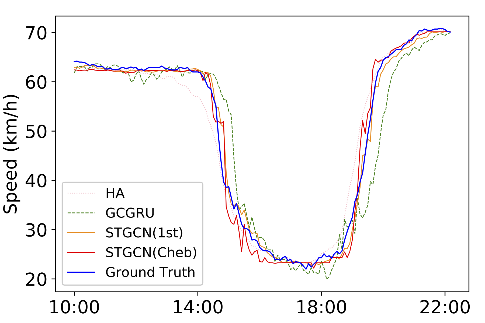
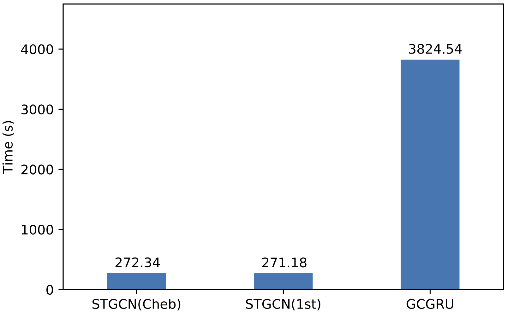

# Spatio-Temporal Graph Convolutional Networks: <br> A Deep Learning Framework for Traffic Forecasting
## Introduction 
We propose a novel deep learning framework, **STGCN**, to tackle time series prediction problem in traffic domain. Instead of applying regular convolutional and recurrent units, we formulate the problem on graphs and build the model with complete convolutional structures. To the best of our knowledge, it is the first time that to apply purely convolutional structures to extract spatio-temporal features simultaneously from graph-structured time series in a traffic study. 

## Problem Formulation
Traffic forecast is a typical time-series prediction problem, i.e. predicting the most likely traffic measurements (e.g. speed or traffic flow) in the next *H* time steps given the previous *M* observations from traffic network *G* as, 
<p align="center"><a href="https://www.codecogs.com/eqnedit.php?latex=\hat{v}_{t&plus;1},&space;...,&space;\hat{v}_{t&plus;H}=\mathop{\arg\max}_{v_{t&plus;1},&space;...,&space;v_{t&plus;H}}&space;\log&space;P(v_{t&plus;1},&space;...,v_{t&plus;H}|v_{t-M&plus;1},&space;...,v_t;G)." target="_blank"></a></p>
  
<p align="center"></p> 
  
**Fig.1 Graph-structured traffic data.**  
Each <a href="https://www.codecogs.com/eqnedit.php?latex=v_t" target="_blank"></a>  indicates a frame of current traffic status at time step *t*, which is recorded in a graph-structured data matrix.

## Network Structure
<p align="center"></p>
  
**Fig. 2 Architecture of spatio-temporal graph convolutional networks.**  
The framework STGCN consists of two spatio-temporal convolutional blocks (ST-Conv blocks) and a fully-connected output layer in the end. Each ST-Conv block contains two temporal gated convolution layers and one spatial graph convolution layer in the middle. The residual connection and bottleneck strategy are applied inside each block. The input <a href="https://www.codecogs.com/eqnedit.php?latex=v_{t-M&plus;1},&space;...,&space;v_t" target="_blank"></a> is uniformly processed by ST-Conv blocks to explore spatial and temporal dependencies coherently. Comprehensive features are integrated by an output layer to generate the final prediction <a href="https://www.codecogs.com/eqnedit.php?latex=\hat{v}" target="_blank"></a>. 

## Results  
|      Model      |                    | PeMSD7(M) (15/30/45 min) |                    |                    | PeMSD7(L) (15/30/45 min) |                    |
|:---------------:|:------------------:|:------------------------:|:------------------:|:------------------:|:------------------------:|:------------------:|
|        /        |         MAE        |          MAPE(%)         |        RMSE        |         MAE        |          MAPE(%)         |        RMSE        |
|        HA       |        4.01        |           10.61          |        7.20        |        4.60        |           12.50          |        8.05        |
|       LSVR      |   2.50/3.63/4.54   |      5.81/8.88/11.50     |   4.55/6.67/8.28   |   2.69/3.85/4.79   |      6.27/9.48/12.42     |   4.88/7.10/8.72   |
|      ARIMA      |   5.55/5.86/6.27   |     12.92/13.94/15.20    |   9.00/9.13/9.38   |   5.50/5.87/6.30   |     12.30/13.54/14.85    |   8.63/8.96/9.39   |
|       FNN       |   2.74/4.02/5.04   |      6.38/9.72/12.38     |   4.75/6.98/8.58   |   2.74/3.92/4.78   |     7.11/10.89/13.56     |   4.87/7.02/8.46   |
|     FC-LSTM     |   3.57/3.94/4.16   |      8.60/9.55/10.10     |   6.20/7.03/7.51   |   4.38/4.51/4.66   |     11.10/11.41/11.69    |   7.68/7.94/8.20   |
|      GCGRU      |   2.37/3.31/4.01   |      5.54/8.06/9.99      |   4.21/5.96/7.13   |  2.48/3.43/4.12∗  |     5.76/8.45/10.51∗    |  4.40/6.25/7.49∗  |
| **STGCN(Cheb)** | **2.25/3.03/3.57** |    5.26/**7.33/8.69**    | **4.04/5.70/6.77** | **2.37/3.27/3.97** |    **5.56/7.98/9.73**    | **4.32/6.21/7.45** |
|  **STGCN(1st)** |   2.26/3.09/3.79   |    **5.24**/7.39/9.12    |   4.07/5.77/7.03   |   2.40/3.31/4.01   |      5.63/8.21/10.12     |   4.38/6.43/7.81   |
  
**Table 1: Performance comparison of different approaches on the dataset PeMSD7.**
  
<p align="center"></p>
  
**Fig. 3: Speed prediction in the morning peak and evening rush hours of the dataset PeMSD7.**
  
<p align="center"></p>
  
**Fig. 4: Time consumptions of training on the dataset PeMSD7 (M, left) and (L, right)**

## Prerequisites
Our code is based on Python3 (>= 3.6). There are a few dependencies to run the code. The major libraries are listed as follows:
* TensorFlow (>= 1.9.0)
* NumPy (>= 1.15)
* SciPy (>= 1.1.0)
* Pandas (>= 0.23)

## Dataset
### Data Source
**[PeMSD7](http://pems.dot.ca.gov/)** was collected from Caltrans Performance Measurement System (PeMS) in real-time by over 39, 000 sensor stations, deployed across the major metropolitan areas of California state highway system. The dataset is also aggregated into 5-minute interval from 30-second data samples. We randomly select a medium and a large scale among the District 7 of California containing **228** and **1, 026** stations, labeled as PeMSD7(M) and PeMSD7(L), respectively, as data sources. The time range of PeMSD7 dataset is in the weekdays of **May and June of 2012**. We select the first month of historical speed records as training set, and the rest serves as validation and test set respectively. 

For detailed introduction of dataset PeMS download, please refer to [issue #6](https://github.com/VeritasYin/STGCN_IJCAI-18/issues/6).

### Data Format
You can make your customized dataset by the following format:  
- PeMSD7_V_.csv : Historical Speed Records with shape of [len_seq * num_road] (len_seq = day_slot * num_dates).
- PeMSD7_W_.csv : Weighted Adjacency Matrix with shape of [num_road * num_road].

Note: please replace the %num_route% with the number of routes in your dataset. '*.csv' should not contain any index or header in the file.

### Data Preprocessing
The standard time interval is set to 5 minutes. Thus, every node of the road graph contains **288** data points per day (day_slot = 288). The linear interpolation method is used to fill missing values after data cleaning. In addition, data input are normalized by Z-Score method.  
In PeMSD7, the adjacency matrix of the road graph is computed based on the distances among stations in the traffic network. The weighted adjacency matrix W can be formed as,  
<p align="center"><a href="https://www.codecogs.com/eqnedit.php?latex=w_{ij}=\left\{&space;\begin{aligned}&space;&\exp(-\frac{{d_{ij}^2}}{{\sigma^2}}),~i&space;\neq&space;j~\text{and}~\exp(-\frac{{d_{ij}^2}}{{\sigma^2}})&space;\geq&space;\epsilon\\&space;&0~~~~~~~~~~~~~,~\text{otherwise}.&space;\end{aligned}&space;\right." target="_blank"></a></p>
  
All of our experiments use 60 minutes as the historical time window, a.k.a. 12 observed data points (M = 12) are used to forecast traffic conditions in the next 15, 30, and 45 minutes (H = 3, 6, 9).

## Model Details
### Training
python main.py --n_route  --graph  

**Default settings**:  
* Training configs: argparse is used for passing parameters. 
    * n_route=228, graph='default', ks=3, kt=3, n_his=12, n_pred=9 
    * batch_size=50, epoch=50, lr=0.001, opt='RMSProp', inf_mode='merge', save=10
* Data source will be searched in dataset_dir = './dataset', including speed records and the weight matrix.
* Trained models will be saved in save_path = './output/models' every  epochs.
* Training logs will be saved in sum_path = './output/tensorboard'.  

Note: it normally takes around 6s on a NVIDIA TITAN Xp for one epoch with the batch size of 50 and n_route of 228.

### Folder structure
```
├── data_loader
│   ├── data_utils.py
│   └── __init__.py
├── dataset
│   ├── PeMSD7_V_228.csv
│   └── PeMSD7_W_228.csv
├── main.py
├── models
│   ├── base_model.py
│   ├── __init__.py
│   ├── layers.py
│   ├── tester.py
│   └── trainer.py
├── output
│   ├── models
│   └── tensorboard
├── README.md
└── utils
    ├── __init__.py
    ├── math_graph.py
    └── math_utils.py
```

## Updates
**Jan. 14, 2019**: 
* Code refactoring based on the [Tensorflow-Project-Template](https://github.com/MrGemy95/Tensorflow-Project-Template), following the PEP 8 code style; 
* Function model_save(), model_test() and tensorboard support are added; 
* The process of model training and inference is optimized;
* Corresponding code comments are updated.

## Citation
Please refer to our paper. Bing Yu*, Haoteng Yin*, Zhanxing Zhu. [Spatio-temporal Graph Convolutional Networks: A Deep Learning Framework for Traffic Forecasting](https://www.ijcai.org/proceedings/2018/0505). In *Proceedings of the 27th International Joint Conference on Artificial Intelligence (IJCAI)*, 2018

    @inproceedings{yu2018spatio,
        title={Spatio-temporal Graph Convolutional Networks: A Deep Learning Framework for Traffic Forecasting},
        author={Yu, Bing and Yin, Haoteng and Zhu, Zhanxing},
        booktitle={Proceedings of the 27th International Joint Conference on Artificial Intelligence (IJCAI)},
        year={2018}
    }

